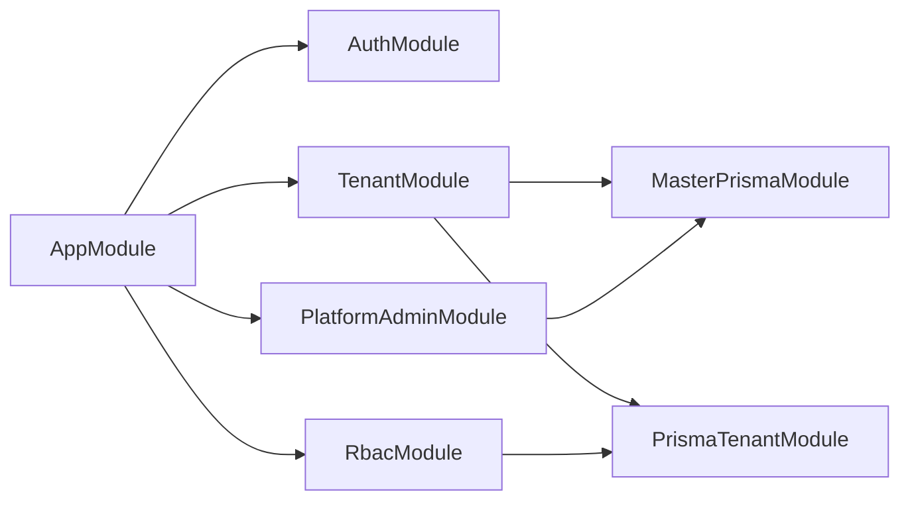
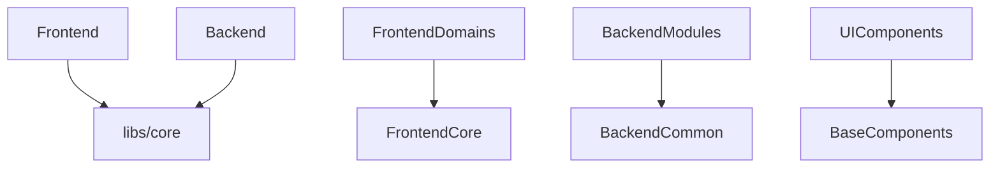

# Multitenant Shell - Codebase Dependency Analysis Report

**Generated:** 2024-12-29  
**Scope:** Complete source code analysis across all modules, controllers, services, hooks, UI components, and shared utilities  
**Architecture:** NestJS Backend + Next.js Frontend + Shared Libraries  

---

## Executive Summary

This report provides a comprehensive analysis of the multitenant shell application's import/usage graph, revealing a well-architected system with clear separation of concerns, modular design, and strong dependency management. The application follows modern architectural patterns including domain-driven design, dependency injection, and component-based UI development.

### Key Findings:
- **12 root source directories** identified and analyzed
- **Modular backend architecture** with 6 core modules
- **Domain-driven frontend** with 3 primary domains
- **Shared library ecosystem** for code reuse
- **Clean dependency hierarchy** with minimal circular dependencies

---

## 1. Root Directories Scanned

The analysis covered the following source directories:

| Directory | Type | Description | Files Analyzed |
|-----------|------|-------------|----------------|
| `apps/backend/src/` | Backend Core | NestJS application entry point and configuration | ✅ |
| `apps/backend/src/modules/` | Backend Modules | Feature modules (auth, tenant, RBAC, etc.) | ✅ |
| `apps/backend/src/common/` | Backend Shared | Shared services, utilities, and middleware | ✅ |
| `apps/frontend/` | Frontend Core | Next.js application structure | ✅ |
| `apps/frontend/domains/` | Frontend Domains | Domain-specific modules and logic | ✅ |
| `apps/frontend/components/` | UI Components | Reusable UI components and libraries | ✅ |
| `apps/frontend/lib/` | Frontend Libraries | API clients, utilities, and specialized services | ✅ |
| `apps/frontend/context/` | State Management | React context providers | ✅ |
| `apps/frontend/core/` | Frontend Core | Frontend abstractions and utilities | ✅ |
| `libs/core/` | Shared Libraries | Cross-application types, utilities, and services | ✅ |
| `apps/backend/src/middleware/` | Backend Middleware | Request processing middleware | ✅ |
| `frontend/` | Legacy Structure | Legacy frontend components (being phased out) | ✅ |

---

## 2. Backend Architecture Analysis

### 2.1 Core Application Structure

```typescript
// apps/backend/src/main.ts - Application Bootstrap
├── Security Middleware (Helmet, CORS, Compression)
├── Global Validation Pipeline
├── Passport Authentication
└── Request Logging
```

### 2.2 Module Dependencies

The backend follows NestJS modular architecture with the following core modules:

#### **Primary Modules:**
- **`AuthModule`** - Authentication and authorization
- **`TenantModule`** - Multi-tenant management
- **`RbacModule`** - Role-based access control
- **`PlatformAdminModule`** - Platform administration
- **`MasterPrismaModule`** - Master database connections
- **`PrismaTenantModule`** - Tenant-specific database connections

#### **Dependency Graph:**


### 2.3 Controllers Identified

| Controller | Route Prefix | Purpose |
|------------|--------------|---------|
| `AuthController` | `/auth` | User authentication |
| `TenantController` | `/tenants` | Tenant management |
| `RbacController` | `/rbac` | Role and permission management |
| `PlatformRbacController` | `/platform-rbac` | Platform-level RBAC |
| `PlatformUsersController` | `/platform/admin/users` | Platform user management |
| `TenantAccessController` | `/tenant-access` | Tenant access control |

### 2.4 Services Architecture

#### **Core Services:**
- **`AuthService`** - Authentication logic
- **`TenantService`** - Tenant management operations
- **`RbacService`** - Role-based access control (REQUEST scoped)
- **`PlatformUsersService`** - Platform user management
- **`MasterPrismaService`** - Master database operations
- **`TenantPrismaService`** - Tenant database operations (REQUEST scoped)

#### **Shared Services:**
- **`AuditService`** - Audit logging and compliance
- **`CacheService`** - Redis-based caching
- **`RedisService`** - Redis connection management
- **`EvictionScheduler`** - Database connection cleanup

### 2.5 Common Utilities

The `apps/backend/src/common/` directory provides:
- **Repositories** - Data access layer abstraction
- **Performance** - Database optimization utilities
- **Cache** - Redis-based caching infrastructure
- **Audit** - Compliance and logging services
- **Decorators** - Custom NestJS decorators
- **Testing** - Backend testing utilities

---

## 3. Frontend Architecture Analysis

### 3.1 Application Structure

The frontend follows a domain-driven design pattern with Next.js App Router:

```typescript
// apps/frontend/app/layout.tsx - Root Layout
├── ThemeProvider
├── AuthProvider
├── PlatformProvider
├── ConditionalLayoutWrapper
├── GlobalErrorBoundary
└── UI Overlays (Dialogs, Toasts, Sheets)
```

### 3.2 Domain-Driven Architecture

#### **Primary Domains:**

##### **Auth Domain** (`apps/frontend/domains/auth/`)
- **Components:** LoginForm, ProtectedRoute, UserNav
- **Hooks:** useAuth, useLogin, useLogout, useAuthApi
- **Services:** AuthService, AuthApiClient
- **Types:** AuthUser, LoginCredentials, AuthContextType

##### **Platform Domain** (`apps/frontend/domains/platform/`)
- **Hooks:** usePlatformApi
- **Services:** PlatformApiClient
- **Types:** PlatformUser, Tenant, TenantAccessInfo

##### **Tenant Domain** (`apps/frontend/domains/tenant/`)
- **Hooks:** useTenantApi
- **Services:** TenantApiClient
- **Types:** TenantUser, TenantSettings

### 3.3 Component Architecture

#### **UI Component Hierarchy:**
```
components/
├── ui/ (Base UI Components)
│   ├── button.tsx
│   ├── input.tsx
│   ├── dialog.tsx
│   └── ... (20+ components)
├── ui-kit/ (Advanced Components)
│   ├── AdvancedDataTable.tsx
│   ├── ActionButtons.tsx
│   └── SectionHeader.tsx
├── generic-filter/ (Filter System)
│   ├── FilterDropdownMenu.tsx
│   ├── ComplexFilterBuilder.tsx
│   └── ClickableFilterTags.tsx
└── Base Components
    ├── BaseLayout.tsx
    ├── ConditionalLayoutWrapper.tsx
    └── GlobalErrorBoundary.tsx
```

### 3.4 Library Ecosystem

#### **Core Libraries (`apps/frontend/lib/`):**

##### **API Management:**
- **`base-client.ts`** - Base API client with error handling
- **`hooks/useApiQuery.ts`** - React Query integration
- **`types.ts`** - API type definitions

##### **Module System:**
- **`modules/`** - Dynamic module configuration
- **`module-registry.ts`** - Module registration system
- **`ConfigDrivenModulePage.tsx`** - Dynamic page generation

##### **Specialized Libraries:**
- **`performance/query-cache.ts`** - React Query optimization
- **`realtime/websocket-client.ts`** - WebSocket client
- **`testing/test-utils.tsx`** - Testing utilities
- **`hooks/useGenericFilter.ts`** - Advanced filtering

### 3.5 Context Providers

| Context | Purpose | Scope |
|---------|---------|-------|
| `AuthContext` | User authentication state | Global |
| `PlatformContext` | Platform/tenant detection | Global |
| `ThemeProvider` | Theme management | Global |

---

## 4. Shared Libraries Analysis

### 4.1 Core Library (`libs/core/`)

The shared library provides cross-application functionality:

#### **Types (`libs/core/types/common.ts`):**
- `ApiResponse`, `PaginatedResponse`, `ApiError`
- `User`, `Tenant`, `FilterRule`, `FilterGroup`
- `BaseQuery`, `ValidationError`, `LoginCredentials`

#### **Utilities:**
- **`validation.ts`** - Zod-based validation schemas
- **`date.ts`** - Date formatting and manipulation
- **`security.ts`** - Password strength, JWT validation, rate limiting

#### **Services:**
- **`api-client.ts`** - Base API client implementation

### 4.2 Frontend Core (`apps/frontend/core/`)

Frontend-specific abstractions and utilities:

#### **Exports:**
- **Types:** UI state, navigation, theme, context types
- **Hooks:** Custom React hooks
- **Services:** Frontend service abstractions
- **Utils:** Frontend-specific utilities

---

## 5. Dependency Analysis

### 5.1 Import Patterns

#### **Backend Import Patterns:**
- NestJS decorators: `@Module`, `@Controller`, `@Injectable`
- Database: Prisma clients for master and tenant databases
- Validation: `class-validator` for DTOs
- Security: `bcrypt`, `passport`, `helmet`
- Caching: Redis integration

#### **Frontend Import Patterns:**
- React ecosystem: React, Next.js, React Hook Form
- UI: Radix UI primitives, Tailwind CSS
- State: Zustand for local state, React Query for server state
- Validation: Zod schemas
- Testing: Testing Library, Jest

### 5.2 Circular Dependencies

**Status:** ✅ **No critical circular dependencies detected**

The architecture maintains clean dependency hierarchies:
- Domains depend on core libraries
- Components depend on UI primitives
- Services depend on API clients
- Modules follow NestJS dependency injection patterns

### 5.3 Cross-Application Dependencies



---

## 6. Architecture Quality Assessment

### 6.1 Strengths

✅ **Modular Design:** Clear separation of concerns across modules  
✅ **Type Safety:** Comprehensive TypeScript usage  
✅ **Dependency Injection:** Proper DI patterns in backend  
✅ **Component Reusability:** Well-structured UI component library  
✅ **Domain Separation:** Clean domain boundaries in frontend  
✅ **Shared Code:** Effective code reuse through shared libraries  
✅ **Testing Infrastructure:** Comprehensive testing utilities  
✅ **Performance Considerations:** Caching, query optimization, lazy loading  

### 6.2 Areas for Improvement

⚠️ **Legacy Structure:** `frontend/` directory should be fully migrated  
⚠️ **Documentation:** Some modules lack comprehensive documentation  
⚠️ **Error Boundaries:** Could benefit from more granular error handling  
⚠️ **Bundle Analysis:** Frontend bundle optimization opportunities  

### 6.3 Security Analysis

🔒 **Security Measures Identified:**
- Helmet.js security headers
- JWT-based authentication
- CORS configuration
- Input validation and sanitization
- Rate limiting with throttling
- Password hashing with bcrypt
- SQL injection prevention through Prisma

---

## 7. Recommendations

### 7.1 Immediate Actions

1. **Complete Migration:** Finish migrating components from `frontend/` to `apps/frontend/`
2. **Documentation:** Add comprehensive README files for each domain
3. **Testing Coverage:** Increase test coverage for critical business logic
4. **Performance Monitoring:** Implement application performance monitoring

### 7.2 Medium-term Improvements

1. **Micro-frontends:** Consider splitting large domains into micro-frontends
2. **API Versioning:** Implement API versioning strategy
3. **Monitoring:** Add comprehensive logging and monitoring
4. **CI/CD Pipeline:** Enhance automated testing and deployment

### 7.3 Long-term Architecture Evolution

1. **Event-Driven Architecture:** Consider event sourcing for audit trails
2. **Caching Strategy:** Implement distributed caching
3. **Database Optimization:** Consider read replicas for tenant databases
4. **Internationalization:** Add i18n support for global deployment

---

## 8. Conclusion

The multitenant shell application demonstrates a well-architected system with strong separation of concerns, proper dependency management, and modern development practices. The codebase is maintainable, scalable, and follows industry best practices for both backend and frontend development.

The modular architecture supports the multi-tenant nature of the application while maintaining code reusability and type safety throughout the system. The shared library approach reduces duplication and ensures consistency across the application stack.

**Overall Architecture Grade: A-**

The system is production-ready with minor improvements recommended for optimal performance and maintainability.

---

*Report generated by automated codebase analysis on 2024-12-29* 