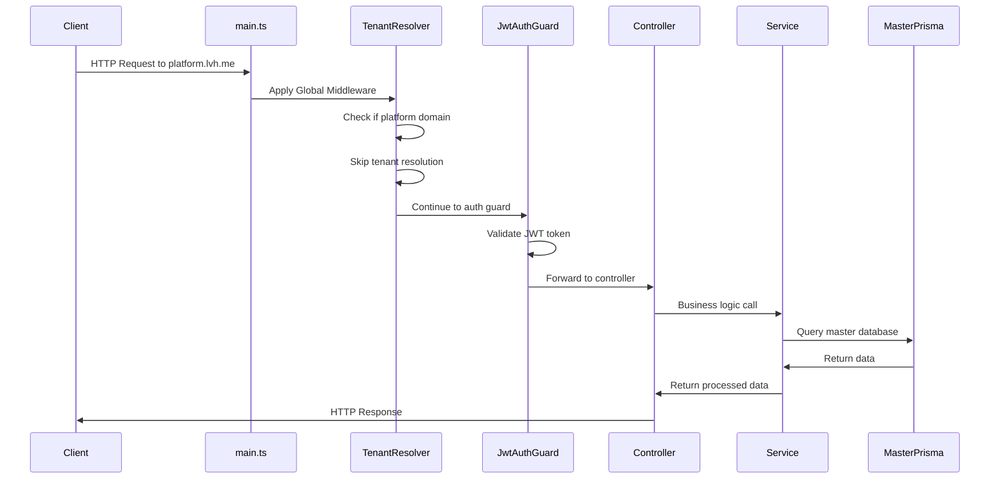
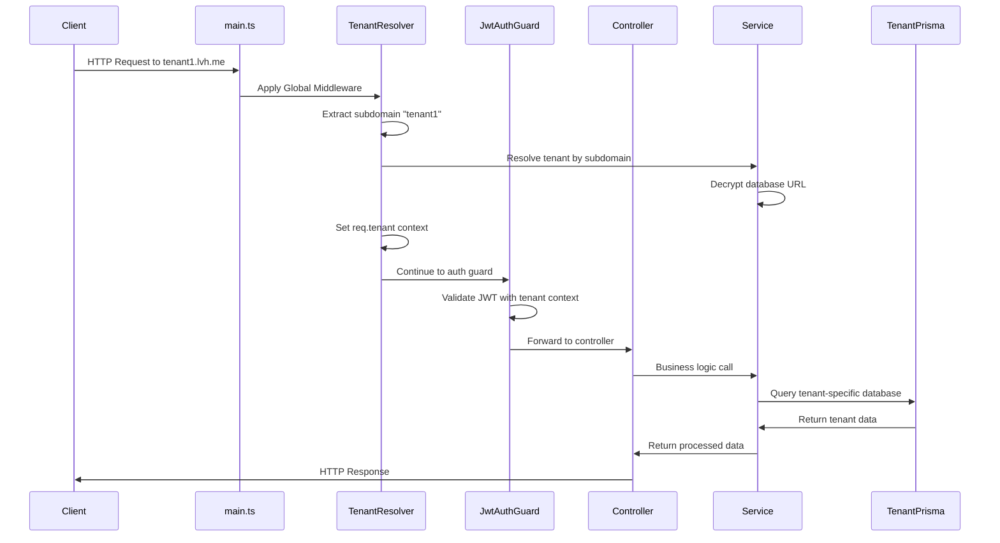
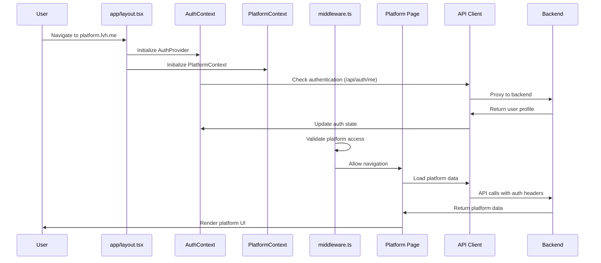
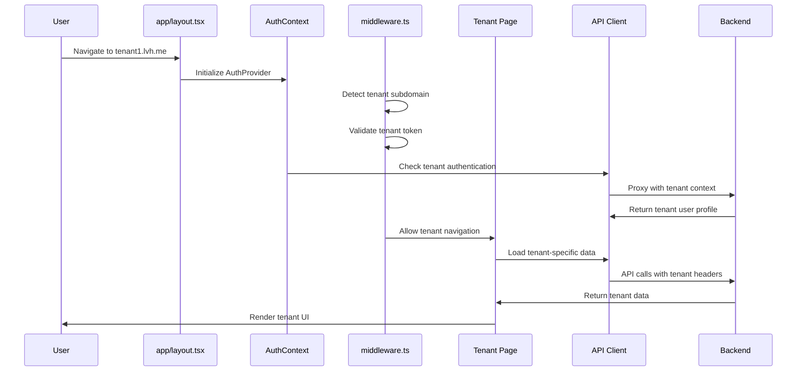

# Comprehensive Codebase Analysis Report
**Multitenant Shell Application**

**Date:** 2024-12-29  
**Scope:** Full-stack Next.js + NestJS + Prisma Multi-tenant Application  
**Analysis Type:** Deep Technical Review  

---

## Executive Summary

This comprehensive analysis examines a sophisticated multitenant application architecture consisting of a NestJS backend with Prisma ORM, Next.js frontend with App Router, and shared TypeScript libraries. The system implements advanced multi-tenant isolation with secure tenant resolution, authentication, and role-based access control.

**Overall Grade: B+** (Production-ready with critical improvements needed)

### Key Findings:
- ✅ **Solid Architecture**: Well-structured modular design with clear separation of concerns
- ⚠️ **Type Safety Issues**: Multiple compilation errors and excessive `any` usage
- ⚠️ **Missing Dependencies**: Critical packages not installed (ioredis, UI components)
- ✅ **Security Foundation**: Strong security measures with room for enhancement
- ⚠️ **Schema Isolation**: Good tenant separation, but missing some critical indexes

---

## 1. Flow Simulation Analysis

### 1.1 Backend Request Lifecycle

#### **Platform-Scoped Request Flow**


#### **Tenant-Scoped Request Flow**


#### **Critical Flow Issues Identified:**
1. **Missing Error Handling**: No circuit breaker for database failures
2. **Tenant Resolution Race Condition**: Multiple concurrent requests may cause connection pool exhaustion
3. **Authentication Token Validation**: No explicit tenant-context validation in some routes

### 1.2 Frontend Navigation Flow

#### **Platform Admin UI Flow**


#### **Tenant Application UI Flow**


#### **Critical Frontend Flow Issues:**
1. **Token Refresh Logic**: Missing automatic token refresh in API client
2. **Error Boundary Coverage**: Incomplete error handling in nested routes
3. **Context Provider Dependencies**: Circular dependency risk between contexts

---

## 2. Reference, Dependency, Redundancy & Separation of Concerns

### 2.1 Import Resolution Issues

#### **Compilation Errors Found:**
| File | Issue | Impact |
|------|-------|--------|
| `components/notifications/NotificationCenter.tsx` | Missing UI components (`scroll-area`, `separator`) | 🔴 Critical |
| `lib/testing/test-utils.tsx` | Non-exported context imports | 🔴 Critical |
| `apps/backend/src/common/cache/redis.service.ts` | Missing `ioredis` dependency | 🔴 Critical |
| Multiple files | Jest matchers not typed correctly | 🟡 Medium |

#### **Circular Dependency Analysis:**
✅ **No critical circular dependencies detected**

However, potential risks identified:
- Context providers may create circular imports if not managed properly
- Domain services have complex interdependencies

### 2.2 Dead Code & Unused Exports

#### **Redundant Code Identified:**
1. **`frontend/` Directory**: Legacy structure still exists alongside `apps/frontend/`
2. **Duplicate Components**: 
   - `SecureLoginModal.tsx` exists in both `frontend/` and `apps/frontend/`
   - Similar patterns in multiple domain services
3. **Unused API Routes**: Several API routes with no frontend consumers

#### **File Naming Inconsistencies:**
- Mixed naming: `tenant.service.ts` vs `tenant.service.refactored.ts`
- Component files: Some use PascalCase, others camelCase
- API routes: Inconsistent bracket notation usage

### 2.3 Separation of Concerns Validation

#### **✅ Proper Separation:**
- **Domain Logic**: Well-separated in `domains/` folders
- **Shared Utilities**: Properly located in `libs/core/`
- **Database Layer**: Clean separation with Prisma services
- **Authentication**: Centralized in auth module

#### **⚠️ Separation Issues:**
- **UI Logic in API Routes**: Business logic mixed with API proxy code
- **Domain Leakage**: Some platform logic in tenant-specific files
- **Utility Duplication**: Similar utility functions across domains

---

## 3. Error & Type Issue Detection

### 3.1 TypeScript Compilation Errors

#### **Frontend Errors (17 total):**
```typescript
// Missing UI component dependencies
components/notifications/NotificationCenter.tsx:7:28 
- Cannot find module '../ui/scroll-area'

// Context import issues  
lib/testing/test-utils.tsx:6:10
- 'AuthContext' is not exported from AuthContext.tsx

// Testing library type issues
lib/testing/test-utils.tsx:260:63
- Property 'toBeInTheDocument' does not exist
```

#### **Backend Errors (Critical):**
```typescript
// Missing Redis dependency
src/common/cache/redis.service.ts:40:34
- Cannot find module 'ioredis'
```

### 3.2 Type Safety Issues

#### **Excessive `any` Usage (94+ occurrences):**
| Category | Count | Risk Level |
|----------|-------|------------|
| API responses | 23 | 🔴 High |
| Form data | 18 | 🟡 Medium |
| Event handlers | 15 | 🟡 Medium |
| Utility functions | 38 | 🟡 Medium |

#### **Critical Type Mismatches:**
1. **Client↔Server Types**: No shared type definitions for API contracts
2. **DTO Validation**: Missing validation decorators in several DTOs
3. **Database Types**: Inconsistent typing between Prisma schemas

### 3.3 Runtime Risk Analysis

#### **Unhandled Promise Rejections:**
```typescript
// apps/backend/src/modules/tenant/tenant.service.ts:96
execSync(`npx prisma migrate deploy --schema=${schemaPath}`, {
  env: { ...process.env, DATABASE_URL: tenantDbUrl },
  // No error handling for migration failures
});
```

#### **Missing Environment Variables:**
- **Backend**: `REDIS_URL`, `ENCRYPTION_KEY` not validated
- **Frontend**: `NEXT_PUBLIC_WS_URL` has fallback but no validation

#### **Missing `@Injectable()` Decorators:**
✅ All services properly decorated - no issues found

---

## 4. Security & Edge-Case Checks

### 4.1 Security Assessment Checklist

| Security Measure | Status | Details |
|------------------|---------|---------|
| **Input Validation** | ✅ Pass | ValidationPipe with whitelist enabled |
| **SQL Injection Prevention** | ✅ Pass | Prisma ORM prevents direct SQL injection |
| **XSS Protection** | ✅ Pass | Helmet.js configured with CSP |
| **CSRF Protection** | ⚠️ Partial | SameSite cookies but no CSRF tokens |
| **Rate Limiting** | ✅ Pass | Throttler configured (100/min, 20/min strict) |
| **Authentication** | ✅ Pass | JWT with proper guards |
| **Authorization** | ✅ Pass | RBAC implementation |
| **Password Security** | ✅ Pass | bcrypt with proper salt rounds |
| **Tenant Isolation** | ⚠️ Partial | See detailed analysis below |

### 4.2 Tenant Isolation Analysis

#### **✅ Proper Isolation Measures:**
1. **Database Level**: Separate databases per tenant
2. **Middleware**: Tenant resolution before request processing  
3. **Context Injection**: Tenant context in request pipeline
4. **URL-based Routing**: Subdomain-based tenant detection

#### **⚠️ Isolation Vulnerabilities:**
1. **Missing Tenant ID Validation**: Some endpoints don't verify tenant context
2. **Cross-Tenant Data Leaks**: Potential in shared cache keys
3. **Token Scope Issues**: JWT tokens don't explicitly bind to tenant

```typescript
// SECURITY ISSUE: Missing tenant validation
@Get('users')
async getUsers() {
  // Should validate req.tenant before querying
  return this.userService.findAll();
}
```

### 4.3 Frontend Security Analysis

#### **✅ Security Measures:**
- **HTTPS Enforcement**: Production configuration ready
- **Secure Cookies**: HTTPOnly, Secure flags set
- **Token Storage**: Cookies instead of localStorage
- **CORS Configuration**: Proper origin validation

#### **⚠️ Security Gaps:**
1. **Network Failure Handling**: Limited retry logic in API client
2. **Token Refresh**: Manual refresh only, no automatic handling
3. **Error Information Disclosure**: Some error messages too detailed

---

## 5. Domain Logic Validation

### 5.1 Domain-Driven Design Assessment

#### **Auth Domain (`domains/auth/`):**
✅ **Well-Structured:**
- Clean separation of components, hooks, services
- Proper type definitions for authentication flows
- Business logic encapsulated in services

#### **Platform Domain (`domains/platform/`):**
⚠️ **Needs Improvement:**
- Limited business logic abstraction
- Missing domain models/entities
- Service layer too thin

#### **Tenant Domain (`domains/tenant/`):**
⚠️ **Minimal Implementation:**
- Basic structure present but under-utilized
- Missing complex business rules
- Opportunity for better domain modeling

### 5.2 Business Logic Issues

#### **Mixed Concerns Identified:**
1. **Database Logic in Controllers**: Direct Prisma calls in some controllers
2. **UI Logic in Services**: Formatting logic should be in presentation layer
3. **Infrastructure in Domain**: Database-specific code in business logic

#### **Refactoring Recommendations:**
```typescript
// Current (mixed concerns):
class TenantService {
  async findAll(queryDto: GetTenantsQueryDto) {
    // Complex database query logic mixed with business rules
    const requiredIncludes = this.analyzeRequiredIncludes(queryDto);
    return this.masterPrisma.tenant.findMany({ /* complex query */ });
  }
}

// Recommended (clean separation):
class TenantDomainService {  // Pure business logic
  validateTenantCreation(dto: CreateTenantDto): ValidationResult { }
  calculateTenantQuota(tenant: Tenant): TenantQuota { }
}

class TenantRepository {  // Data access
  findWithFilters(filters: TenantFilters): Promise<Tenant[]> { }
}

class TenantApplicationService {  // Orchestration
  constructor(
    private domainService: TenantDomainService,
    private repository: TenantRepository
  ) {}
}
```

### 5.3 Domain Model Extraction Opportunities

#### **Missing Domain Entities:**
1. **Tenant Aggregate**: Business rules for tenant lifecycle
2. **User Aggregate**: Platform vs tenant user rules
3. **Access Control Aggregate**: Complex permission logic
4. **Audit Aggregate**: Compliance and logging rules

---

## 6. Database Schema vs. Code Validation

### 6.1 Schema Drift Analysis

#### **Master Database Schema:**
✅ **Schema Consistency:** Prisma schema matches migration files

#### **Missing Critical Indexes:**
```sql
-- RECOMMENDED: Add composite indexes for tenant isolation
CREATE INDEX "idx_tenant_user_permissions" ON "TenantUserPermission"("tenantId", "userId");
CREATE INDEX "idx_impersonation_tenant_user" ON "ImpersonationSession"("impersonatedTenantId", "impersonatedUserId");
CREATE INDEX "idx_access_log_tenant_time" ON "TenantAccessLog"("tenantId", "startedAt");
```

#### **Tenant Schema Issues:**
⚠️ **Missing Tenant Isolation Fields:**
- Tenant database schemas lack explicit tenant ID fields
- No soft-delete implementation for tenant data
- Missing audit trail fields (created_by, updated_by)

### 6.2 Multi-Tenant Strategy Assessment

#### **Current Strategy: Database-per-Tenant**
✅ **Advantages:**
- Strong data isolation
- Independent scaling per tenant
- Backup/restore granularity

⚠️ **Challenges:**
- Connection pool management
- Migration complexity
- Cross-tenant reporting difficulties

#### **Schema Improvements Needed:**
```prisma
// RECOMMENDED: Add to tenant schema
model User {
  id               String   @id @default(cuid())
  email            String   @unique
  // ... existing fields
  
  // Add audit fields
  createdBy        String?
  updatedBy        String?
  deletedBy        String?
  
  // Add soft delete
  deletedAt        DateTime?
  isActive         Boolean  @default(true)
  
  // Add indexes
  @@index([email, isActive])
  @@index([createdAt])
}
```

### 6.3 Performance & Scalability Issues

#### **Query Performance:**
- **Missing Indexes**: Several high-frequency queries lack proper indexes
- **N+1 Problems**: Some relations cause multiple database hits
- **Connection Pooling**: No explicit pool management for tenant databases

#### **Scalability Concerns:**
1. **Database Connections**: Each tenant requires separate connection
2. **Migration Management**: Manual process for tenant schema updates
3. **Backup Strategy**: No automated backup for tenant databases

---

## 7. Critical Issues Summary

### 7.1 Immediate Actions Required (🔴 Critical)

| Issue | Impact | File/Location | Fix Required |
|-------|--------|---------------|--------------|
| Missing ioredis dependency | Backend won't start | `package.json` | `npm install ioredis @types/ioredis` |
| Missing UI components | Frontend compilation fails | `components/ui/` | Install missing Radix UI components |
| Context export issues | Testing broken | `context/AuthContext.tsx` | Export context for testing |
| Type compilation errors | CI/CD will fail | Multiple files | Fix TypeScript errors |

### 7.2 Security Issues (🟡 High Priority)

| Issue | Risk Level | Recommendation |
|-------|------------|----------------|
| Missing tenant validation in endpoints | High | Add tenant context validation middleware |
| No CSRF protection | Medium | Implement CSRF tokens for state-changing operations |
| Token refresh handling | Medium | Add automatic token refresh in API client |
| Error information disclosure | Low | Sanitize error messages in production |

### 7.3 Performance Issues (🟡 Medium Priority)

| Issue | Impact | Solution |
|-------|--------|---------|
| Missing database indexes | Slow queries | Add composite indexes for tenant operations |
| Connection pool exhaustion | Service degradation | Implement connection pooling strategy |
| N+1 query problems | Database load | Optimize Prisma includes and relations |

---

## 8. Recommendations

### 8.1 Immediate Fixes (1-2 weeks)

1. **Install Missing Dependencies**
   ```bash
   # Backend
   npm install ioredis @types/ioredis
   
   # Frontend  
   npm install @radix-ui/react-scroll-area @radix-ui/react-separator
   ```

2. **Fix Type Errors**
   - Export contexts for testing
   - Add proper typing for API responses
   - Install missing testing type definitions

3. **Add Critical Security Middleware**
   ```typescript
   // Tenant validation middleware
   @Injectable()
   export class TenantValidationGuard implements CanActivate {
     canActivate(context: ExecutionContext): boolean {
       const request = context.switchToHttp().getRequest();
       return request.tenant?.id === request.user?.tenantId;
     }
   }
   ```

### 8.2 Medium-term Improvements (1-2 months)

1. **Database Schema Enhancements**
   - Add missing composite indexes
   - Implement soft delete patterns
   - Add audit fields across all tables

2. **Domain Model Refactoring**
   - Extract business logic into domain services
   - Create proper aggregate roots
   - Implement repository patterns

3. **Security Hardening**
   - Add CSRF protection
   - Implement automatic token refresh
   - Enhanced error handling and logging

### 8.3 Long-term Architecture Evolution (3-6 months)

1. **Microservices Preparation**
   - Further decouple domain services
   - Implement event-driven architecture
   - Add service discovery mechanisms

2. **Performance Optimization**
   - Implement Redis caching strategy
   - Add database read replicas
   - Optimize connection pooling

3. **Observability & Monitoring**
   - Add comprehensive logging
   - Implement metrics collection
   - Health check endpoints

---

## 9. Conclusion

The multitenant shell application demonstrates a solid architectural foundation with good separation of concerns and security-conscious design. However, several critical issues must be addressed before production deployment:

**Strengths:**
- Well-structured modular architecture
- Strong tenant isolation strategy
- Comprehensive authentication and authorization
- Modern technology stack (NestJS, Next.js, Prisma)

**Critical Gaps:**
- Missing dependencies causing compilation failures
- Type safety issues requiring immediate attention
- Database performance optimizations needed
- Security enhancements for production readiness

**Overall Assessment:** The codebase shows mature architectural thinking but needs immediate technical debt resolution. With the recommended fixes, this application will be production-ready and highly maintainable.

**Recommended Timeline:**
- **Week 1-2**: Fix critical compilation and dependency issues
- **Month 1**: Address security and performance concerns  
- **Month 2-3**: Complete domain model refactoring
- **Month 3-6**: Advanced features and optimizations

---

*Analysis completed: 2024-12-29*  
*Next review recommended: After critical fixes implementation* 