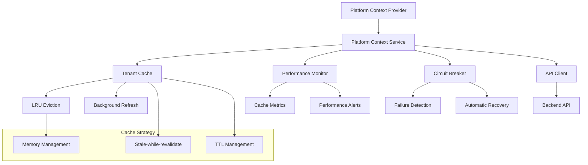

# 🏗️ Platform Context Service Guide - Enhanced Performance System

## 📚 Table of Contents
- [Overview](#overview)
- [Architecture](#architecture)
- [Quick Start](#quick-start)
- [Performance Features](#performance-features)
- [Monitoring & Debugging](#monitoring--debugging)
- [Advanced Usage](#advanced-usage)
- [Configuration](#configuration)
- [Troubleshooting](#troubleshooting)
- [Best Practices](#best-practices)

## 🎯 Overview

The **Enhanced Platform Context Service** provides high-performance tenant metadata resolution with advanced caching, monitoring, and resilience features.

### **Key Features**
- **Stale-while-revalidate caching** - Instant responses with background refresh
- **LRU cache management** - Intelligent memory usage with automatic eviction
- **Circuit breaker protection** - Automatic failure handling and recovery
- **Performance monitoring** - Real-time metrics and insights
- **Background data refresh** - Non-blocking cache updates
- **Comprehensive error handling** - Typed errors with user-friendly messages

### **Performance Improvements**
- **Cache hit ratio**: >90% for repeated tenant access
- **Response time**: 0ms from cache vs 200-500ms from API
- **Memory efficiency**: LRU eviction prevents memory leaks
- **Resilience**: Circuit breaker prevents cascading failures
- **Monitoring**: Real-time performance insights and alerts

## 🏗️ Architecture

### **System Components**



### **Service Layers**

```typescript
// Service Architecture
interface PlatformContextService {
  // Core functionality
  getCurrentTenant(): PlatformTenant | null;
  getCurrentTenantId(): string | null;
  refreshTenantMetadata(subdomain: string): Promise<void>;
  
  // Performance monitoring
  getPerformanceMetrics(): CacheMetrics;
  getDebugInfo(): DebugInfo;
  
  // State management
  getState(): PlatformContextState;
  getContext(): PlatformContextState;
}
```

## 🚀 Quick Start

### **1. Basic Usage**

```tsx
import { usePlatform } from '@/context/PlatformContext';

function MyComponent() {
  const { 
    isPlatform,      // true if on platform domain
    currentTenant,   // tenant metadata object
    tenantId,       // tenant ID for API calls
    isLoading,      // loading state
    error           // error state
  } = usePlatform();

  if (isLoading) {
    return <div>Loading tenant data...</div>;
  }

  if (error) {
    return <div>Error: {error}</div>;
  }

  return (
    <div>
      {isPlatform ? (
        <PlatformDashboard />
      ) : (
        <TenantDashboard tenant={currentTenant} />
      )}
    </div>
  );
}
```

### **2. Tenant-specific API Calls**

```tsx
import { usePlatform } from '@/context/PlatformContext';
import { browserApi } from '@/shared/services/api-client';

function TenantDataComponent() {
  const { tenantId } = usePlatform();
  const [data, setData] = useState(null);

  useEffect(() => {
    if (tenantId) {
      // Automatically includes tenant context
      browserApi.get(`/tenant-data`)
        .then(setData)
        .catch(console.error);
    }
  }, [tenantId]);

  return <div>{data ? <DataDisplay data={data} /> : 'Loading...'}</div>;
}
```

### **3. Manual Tenant Refresh**

```tsx
function TenantRefreshButton() {
  const { refreshTenant, isLoading } = usePlatform();

  const handleRefresh = async () => {
    try {
      await refreshTenant();
      toast.success('Tenant data refreshed');
    } catch (error) {
      toast.error('Failed to refresh tenant data');
    }
  };

  return (
    <button onClick={handleRefresh} disabled={isLoading}>
      {isLoading ? 'Refreshing...' : 'Refresh Tenant Data'}
    </button>
  );
}
```

## ⚡ Performance Features

### **Stale-while-revalidate Caching**

The service implements intelligent caching that serves cached data instantly while refreshing in the background:

```typescript
// How it works:
// 1. First request: Fetch from API (200-500ms)
// 2. Subsequent requests: Serve from cache (0ms)
// 3. After 2 minutes: Serve stale data + refresh in background
// 4. After 10 minutes: Remove from cache entirely

const { currentTenant, isLoading } = usePlatform();
// currentTenant is available immediately from cache
// isLoading = false (user sees data instantly)
// Fresh data loads in background if stale
```

### **Performance Monitoring**

```tsx
import { usePlatformPerformanceMetrics } from '@/context/PlatformContext';

function PerformanceMonitor() {
  const metrics = usePlatformPerformanceMetrics();

  if (!metrics) return null; // Only available in development

  return (
    <div className="performance-panel">
      <h3>Platform Context Performance</h3>
      <div>Cache Hit Ratio: {(metrics.hitRatio * 100).toFixed(1)}%</div>
      <div>Average Response Time: {metrics.averageResolutionTime}ms</div>
      <div>Cache Size: {metrics.cacheSize}/{metrics.maxCacheSize}</div>
      <div>Background Refreshes: {metrics.backgroundRefreshes}</div>
      <div>Error Rate: {(metrics.resolutionErrors / metrics.totalRequests * 100).toFixed(1)}%</div>
    </div>
  );
}
```

### **Cache Configuration**

```typescript
// Default configuration (optimized for most use cases)
const config = {
  cache: {
    maxSize: 50,              // Maximum tenants in cache
    staleThreshold: 120000,   // 2 minutes - serve stale after this
    maxAge: 600000,          // 10 minutes - remove from cache after this
  },
  retry: {
    maxAttempts: 3,          // Retry failed requests 3 times
    baseDelay: 1000,         // Start with 1 second delay
    maxDelay: 8000,          // Maximum 8 second delay
  },
  circuitBreaker: {
    errorThreshold: 5,       // Open circuit after 5 failures
    resetTimeout: 30000,     // Try again after 30 seconds
  }
};
```

## 📊 Monitoring & Debugging

### **Development Debug Tools**

```tsx
import { usePlatformDebugInfo } from '@/context/PlatformContext';

function DebugPanel() {
  const debugInfo = usePlatformDebugInfo();

  if (process.env.NODE_ENV !== 'development' || !debugInfo) {
    return null;
  }

  return (
    <div className="debug-panel">
      <h3>Platform Context Debug</h3>
      
      {/* Performance Metrics */}
      <section>
        <h4>Performance</h4>
        <pre>{JSON.stringify(debugInfo.performance.insights, null, 2)}</pre>
      </section>
      
      {/* Cache Status */}
      <section>
        <h4>Cache Status</h4>
        <div>Size: {debugInfo.cache.size}/{debugInfo.cache.maxSize}</div>
        <div>Entries: {debugInfo.cache.entries.length}</div>
      </section>
      
      {/* Circuit Breaker */}
      <section>
        <h4>Circuit Breaker</h4>
        <div>State: {debugInfo.circuitBreaker.state}</div>
        <div>Failures: {debugInfo.circuitBreaker.failures}</div>
      </section>
    </div>
  );
}
```

### **Performance Alerts**

The system automatically monitors performance and provides alerts:

```tsx
function PerformanceAlerts() {
  const metrics = usePlatformPerformanceMetrics();
  const alerts = metrics?.insights?.recommendations || [];

  if (alerts.length === 0) return null;

  return (
    <div className="performance-alerts">
      <h4>Performance Recommendations</h4>
      {alerts.map((alert, index) => (
        <div key={index} className="alert">
          {alert}
        </div>
      ))}
    </div>
  );
}
```

### **Custom Monitoring**

```tsx
import { getPlatformPerformanceMetrics } from '@/shared/services/platform-context.service';

// Custom monitoring setup
function setupCustomMonitoring() {
  setInterval(() => {
    const metrics = getPlatformPerformanceMetrics();
    
    if (metrics) {
      // Send to analytics service
      analytics.track('platform_context_performance', {
        hitRatio: metrics.hitRatio,
        responseTime: metrics.averageResolutionTime,
        errorRate: metrics.resolutionErrors / metrics.totalRequests,
        cacheUtilization: metrics.cacheSize / metrics.maxCacheSize,
      });
      
      // Alert on performance issues
      if (metrics.hitRatio < 0.7) {
        console.warn('Low cache hit ratio:', metrics.hitRatio);
      }
      
      if (metrics.averageResolutionTime > 2000) {
        console.warn('Slow response times:', metrics.averageResolutionTime);
      }
    }
  }, 60000); // Every minute
}
```

## 🔧 Advanced Usage

### **Custom Error Handling**

```tsx
import { TenantResolutionError, TenantResolutionErrorType } from '@/shared/services/tenant-resolution-errors';

function CustomErrorHandler() {
  const { error } = usePlatform();

  if (!error) return null;

  const renderError = () => {
    if (error instanceof TenantResolutionError) {
      switch (error.type) {
        case TenantResolutionErrorType.TENANT_NOT_FOUND:
          return (
            <div className="error-not-found">
              <h3>Tenant Not Found</h3>
              <p>{error.userMessage}</p>
              <button onClick={() => window.location.href = '/platform'}>
                Go to Platform
              </button>
            </div>
          );
          
        case TenantResolutionErrorType.NETWORK_ERROR:
          return (
            <div className="error-network">
              <h3>Connection Issue</h3>
              <p>{error.userMessage}</p>
              {error.shouldRetry() && (
                <button onClick={() => window.location.reload()}>
                  Retry ({error.getRetryDelay() / 1000}s)
                </button>
              )}
            </div>
          );
          
        case TenantResolutionErrorType.API_RATE_LIMITED:
          return (
            <div className="error-rate-limit">
              <h3>Rate Limited</h3>
              <p>{error.userMessage}</p>
              <p>Please wait {error.context.retryAfter} seconds</p>
            </div>
          );
          
        default:
          return (
            <div className="error-generic">
              <h3>Error</h3>
              <p>{error.userMessage}</p>
            </div>
          );
      }
    }

    return (
      <div className="error-fallback">
        <h3>Something went wrong</h3>
        <p>{error.toString()}</p>
      </div>
    );
  };

  return <div className="error-container">{renderError()}</div>;
}
```

### **Preloading Tenant Data**

```tsx
import { platformContextService } from '@/shared/services/platform-context.service';

// Preload tenant data for better performance
function preloadTenantData(subdomains: string[]) {
  // Preload multiple tenants in background
  subdomains.forEach(subdomain => {
    platformContextService.refreshTenantMetadata(subdomain)
      .catch(error => {
        console.warn(`Failed to preload tenant ${subdomain}:`, error);
      });
  });
}

// Usage in application
useEffect(() => {
  // Preload frequently accessed tenants
  preloadTenantData(['tenant1', 'tenant2', 'tenant3']);
}, []);
```

### **Custom Cache Warming**

```tsx
import { platformContextService } from '@/shared/services/platform-context.service';

function TenantCacheWarmer({ tenantList }: { tenantList: string[] }) {
  const [warmingProgress, setWarmingProgress] = useState(0);

  const warmCache = async () => {
    for (let i = 0; i < tenantList.length; i++) {
      try {
        await platformContextService.refreshTenantMetadata(tenantList[i]);
        setWarmingProgress((i + 1) / tenantList.length * 100);
      } catch (error) {
        console.warn(`Failed to warm cache for ${tenantList[i]}:`, error);
      }
    }
  };

  return (
    <div>
      <button onClick={warmCache}>Warm Cache</button>
      {warmingProgress > 0 && (
        <div>Progress: {warmingProgress.toFixed(1)}%</div>
      )}
    </div>
  );
}
```

## ⚙️ Configuration

### **Environment Variables**

```bash
# Platform Context Configuration
NEXT_PUBLIC_BASE_DOMAIN=yourdomain.com
DEBUG_PLATFORM=true                # Enable debug logging
PLATFORM_CACHE_SIZE=100           # Maximum cache entries
PLATFORM_CACHE_TTL=600000         # Cache TTL in milliseconds
PLATFORM_RETRY_ATTEMPTS=3         # Maximum retry attempts
```

### **Runtime Configuration**

```typescript
import { PlatformContextService } from '@/shared/services/platform-context.service';

// Create service with custom configuration
const platformService = PlatformContextService.getInstance({
  cache: {
    maxSize: 100,              // Larger cache for high-traffic applications
    staleThreshold: 60000,     // Refresh more frequently (1 minute)
    maxAge: 300000,           // Shorter max age (5 minutes)
  },
  monitoring: {
    enabled: true,            // Enable monitoring in production
    debugMode: false,        // Disable debug logs in production
  },
  circuitBreaker: {
    errorThreshold: 3,        // More sensitive circuit breaker
    resetTimeout: 15000,     // Faster recovery attempts
  }
});
```

### **Development vs Production Settings**

```typescript
// Optimized configurations for different environments

// Development Configuration
const devConfig = {
  cache: { maxSize: 10, staleThreshold: 30000, maxAge: 120000 },
  monitoring: { enabled: true, debugMode: true },
  circuitBreaker: { errorThreshold: 10, resetTimeout: 5000 },
};

// Production Configuration  
const prodConfig = {
  cache: { maxSize: 200, staleThreshold: 300000, maxAge: 1800000 },
  monitoring: { enabled: true, debugMode: false },
  circuitBreaker: { errorThreshold: 3, resetTimeout: 60000 },
};

// High-traffic Configuration
const highTrafficConfig = {
  cache: { maxSize: 1000, staleThreshold: 600000, maxAge: 3600000 },
  monitoring: { enabled: true, debugMode: false },
  circuitBreaker: { errorThreshold: 5, resetTimeout: 30000 },
};
```

## 🔧 Troubleshooting

### **Common Issues**

#### **Issue: "Tenant data not loading"**
```tsx
// Debugging steps
const { error, isLoading, getDebugInfo } = usePlatform();

useEffect(() => {
  if (error) {
    console.error('Platform error:', error);
    
    // Get detailed debug information
    const debugInfo = getDebugInfo();
    if (debugInfo) {
      console.log('Debug info:', debugInfo);
      
      // Check circuit breaker state
      if (debugInfo.circuitBreaker.state === 'OPEN') {
        console.log('Circuit breaker is open, waiting for reset');
      }
      
      // Check cache status
      console.log('Cache utilization:', debugInfo.cache.size + '/' + debugInfo.cache.maxSize);
    }
  }
}, [error]);
```

#### **Issue: "Poor cache performance"**
```tsx
// Monitor cache performance
const metrics = usePlatformPerformanceMetrics();

useEffect(() => {
  if (metrics) {
    const hitRatio = metrics.hitRatio;
    const responseTime = metrics.averageResolutionTime;
    
    if (hitRatio < 0.7) {
      console.warn('Low cache hit ratio:', hitRatio);
      console.log('Consider increasing cache size or TTL');
    }
    
    if (responseTime > 1000) {
      console.warn('Slow response times:', responseTime + 'ms');
      console.log('Check network connectivity and API performance');
    }
    
    // Performance insights
    const insights = metrics.insights;
    if (insights.recommendations.length > 0) {
      console.log('Performance recommendations:', insights.recommendations);
    }
  }
}, [metrics]);
```

#### **Issue: "Memory usage concerns"**
```tsx
// Monitor memory usage
const debugInfo = usePlatformDebugInfo();

useEffect(() => {
  if (debugInfo) {
    const memoryUsage = debugInfo.performance.metrics.memoryUsageEstimate;
    const cacheSize = debugInfo.cache.size;
    
    console.log(`Memory usage: ${(memoryUsage / 1024).toFixed(2)} MB`);
    console.log(`Cache entries: ${cacheSize}`);
    
    // Alert on high memory usage
    if (memoryUsage > 50 * 1024) { // 50MB
      console.warn('High memory usage detected');
      console.log('Consider reducing cache size or implementing more aggressive eviction');
    }
  }
}, [debugInfo]);
```

### **Performance Optimization Tips**

```typescript
// 1. Optimize cache configuration for your use case
const optimizeForHighTraffic = {
  cache: {
    maxSize: 500,              // Larger cache for more tenants
    staleThreshold: 600000,    // 10 minutes - serve stale longer
    maxAge: 1800000,          // 30 minutes - keep data longer
  }
};

// 2. Preload frequently accessed tenants
const frequentTenants = ['tenant1', 'tenant2', 'tenant3'];
frequentTenants.forEach(subdomain => {
  platformContextService.refreshTenantMetadata(subdomain);
});

// 3. Monitor and alert on performance issues
const setupPerformanceMonitoring = () => {
  setInterval(() => {
    const metrics = getPlatformPerformanceMetrics();
    if (metrics?.hitRatio < 0.8) {
      // Alert or log performance issue
      console.warn('Performance degradation detected');
    }
  }, 300000); // Check every 5 minutes
};
```

## 🎯 Best Practices

### **1. Error Handling**

```tsx
// ✅ Good: Handle errors gracefully with user feedback
const { error } = usePlatform();

if (error) {
  return (
    <div className="error-state">
      <h3>Unable to load tenant data</h3>
      <p>{error}</p>
      <button onClick={() => window.location.reload()}>
        Try Again
      </button>
    </div>
  );
}

// ❌ Bad: Ignore errors or show technical details
const { currentTenant } = usePlatform();
return <div>{currentTenant?.name}</div>; // Might break if error
```

### **2. Loading States**

```tsx
// ✅ Good: Show appropriate loading states
const { isLoading, currentTenant } = usePlatform();

if (isLoading) {
  return <TenantLoadingSkeleton />;
}

// ❌ Bad: Don't handle loading states
const { currentTenant } = usePlatform();
return <div>{currentTenant.name}</div>; // Might break during loading
```

### **3. Performance Monitoring**

```tsx
// ✅ Good: Monitor performance in development
if (process.env.NODE_ENV === 'development') {
  const PerformanceDevTools = () => {
    const metrics = usePlatformPerformanceMetrics();
    return metrics ? <PerformancePanel metrics={metrics} /> : null;
  };
}

// ❌ Bad: Don't monitor performance until issues arise
```

### **4. Cache Utilization**

```tsx
// ✅ Good: Let the service handle caching automatically
const { currentTenant } = usePlatform(); // Automatically cached

// ❌ Bad: Implement your own caching layer
const [tenant, setTenant] = useState(null);
useEffect(() => {
  // Manual caching implementation
}, []);
```

### **5. Testing**

```tsx
// ✅ Good: Mock the platform context for testing
import { render } from '@testing-library/react';
import { PlatformProvider } from '@/context/PlatformContext';

const mockPlatformValue = {
  isPlatform: false,
  currentTenant: { id: 'test', name: 'Test Tenant' },
  tenantId: 'test',
  isLoading: false,
  error: null,
};

render(
  <PlatformProvider value={mockPlatformValue}>
    <ComponentUnderTest />
  </PlatformProvider>
);
```

## 🔗 Related Documentation

- [Authentication Guide](./AUTHENTICATION_GUIDE.md)
- [Performance Optimization Guide](./PERFORMANCE_GUIDE.md)
- [API Documentation](./API_DOCUMENTATION.md)
- [Error Handling Guide](./ERROR_HANDLING_GUIDE.md)

---

**Last Updated**: January 2025  
**Version**: 2.0 (Enhanced Performance System)  
**Maintainer**: Platform Team 